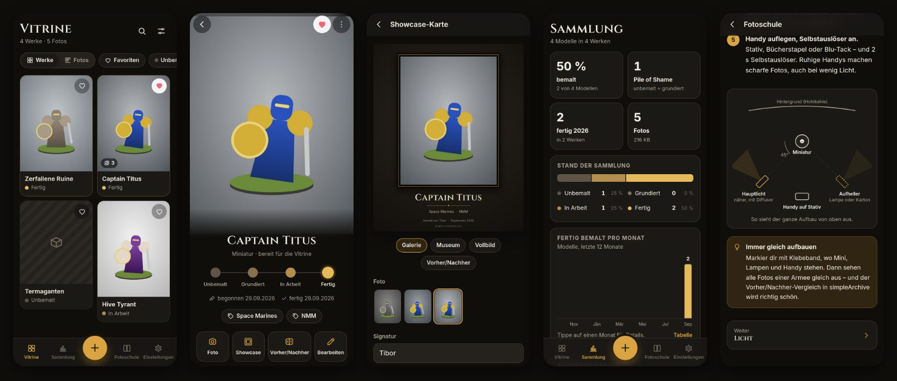

# 🏛️ simpleArchive

**Die Vitrine für deine bemalten Miniaturen und dein Terrain.** Ein werbefreies Fotoarchiv für Tabletop-Maler: jedes Werk mit seinen Fotos, vom Gussrahmen bis zur Vitrine – mit Tags, Favoriten, Fortschritt, Vorher/Nachher, Showcase-Karten zum Teilen und Backups in die eigene Nextcloud oder ins Google Drive.

Teil der simple\*-Apps – Notizen, Arbeitsweise und Verlauf stehen in [TiborSzw/simpleHub](https://github.com/TiborSzw/simpleHub).



- 📷 **Fotos rein, wie du willst:** Kamera oder mehrere Fotos aus der Galerie. Das Aufnahmedatum wird aus den EXIF-Daten übernommen.
- 🏷️ **Werke statt Fotohaufen:** Name, Art (Miniatur, Einheit, Monster, Fahrzeug, Terrain, Diorama, Büste), Anzahl Modelle, freie **Tags** mit Vorschlägen (System, Technik, Terrain), `#hashtags` direkt im Namen, Rezept & Notizen.
- 🎨 **Fortschritt:** Unbemalt → Grundiert → In Arbeit → Fertig. Jedes Foto merkt sich den Stand, zu dem es entstanden ist – der Verlauf zeigt, wie aus Grau Farbe wurde.
- ❤️ **Favoriten**, Suche, Filter nach Status, Art und Tags, Zeitleiste aller Fotos nach Monaten.
- 🔍 **Vollbild** mit Wischen, Pinch- und Doppeltipp-Zoom, Titelbild wählen, zuschneiden & drehen (native Android-Bearbeitung, das Original bleibt).
- ↔️ **Vorher/Nachher-Regler** zwischen zwei beliebigen Fotos eines Werks.
- 🖼️ **Showcase-Karten** zum Teilen: Galerie (dunkel mit Goldrahmen), Museum (hell mit Ausstellungsschild), Vollbild und Vorher/Nachher – mit Titel, Tags und „bemalt von …“.
- 📱 **Eigenes Handy-Album:** Jedes Foto landet zusätzlich in `Bilder/simpleArchive` und erscheint so in Google Fotos & Co.
- 📊 **Sammlung:** Pile of Shame, Anteil bemalt, fertig pro Monat, Mal-Serie, das Stück, das am längsten wartet.
- 📚 **Fotoschule:** Wie man Minis mit dem Handy fotografiert – Licht, Hintergrund, Handy-Einstellungen (inkl. Pro-Modus), Schärfentiefe, Perspektive, echte Farben (NMM, OSL, Metallics), Nachbearbeiten, Spezialfälle, ein Fotostudio für unter 30 € und eine Checkliste zum Abhaken. Vor der Kamera gibt's auf Wunsch die 5-Punkte-Checkliste.
- ☁️ **Backups:** automatisch und inkrementell in die **Nextcloud** (WebDAV) und/oder ins **Google Drive**, oder als **ZIP** an einen beliebigen Ort. Wiederherstellen auf einem neuen Handy inklusive aller Fotos.
- 🗑️ **Papierkorb:** Gelöschtes bleibt 30 Tage wiederherstellbar, dazu „Rückgängig“ direkt nach dem Löschen.
- 🚫 **Werbefrei, ohne Konto, ohne Tracking.** Fotos werden beim Speichern neu kodiert – GPS-Daten und andere Metadaten fallen dabei weg.

---

## Installieren

Bei jedem Push auf `main` baut GitHub Actions (`.github/workflows/android.yml`) eine signierte APK und veröffentlicht sie unter **Releases** als `simpleArchive-1.0.<n>.apk`.

1. Am Handy das Repo öffnen → **Releases** → neueste Version → APK herunterladen.
2. Die APK öffnen und die Installation erlauben.
3. **Updates:** einfach die neuere APK drüberinstallieren – das Archiv bleibt erhalten (gleicher Schlüssel, steigende Versionsnummer). Bequemer mit [Obtainium](https://github.com/ImranR98/Obtainium).

## Backups

Unter **Einstellungen → Backup**. Beide Ziele können gleichzeitig aktiv sein.

Auf dem Server entsteht dieser Ordner:

```
simpleArchive/
  archive.json                    Werke, Fotos, Einstellungen (neuester Stand)
  history/archive-2026-09-30.json ein Stand pro Tag, 30 Tage aufbewahrt
  photos/p_2026-09-29_ab12cd34.jpg  die Fotos
  thumbs/t_2026-09-29_ab12cd34.jpg  Vorschaubilder
```

Fotos werden nur einmal hochgeladen (sie ändern sich nie), danach wandert pro Backup nur `archive.json`. **Automatisch sichern** läuft nach Änderungen und beim Verlassen der App, standardmäßig **nur im WLAN**. Gelöschte Fotos bleiben im Backup, bis sie aus dem Papierkorb verschwinden.

**Schutz beim Handywechsel:** Liegt im Backup-Ordner schon ein *anderes* Archiv (etwa weil das neue Handy noch leer ist), pausiert die Automatik und die App fragt: wiederherstellen oder bewusst überschreiben.

### Nextcloud

1. In der Nextcloud ein **App-Passwort** anlegen: *Persönliche Einstellungen → Sicherheit → „Neues App-Passwort erstellen“*.
2. In simpleArchive Adresse (`https://cloud.example.com`), Benutzername, App-Passwort und Ordner eintragen → **Verbinden**.
3. Fertig. Statt einer Nextcloud geht jede WebDAV-Adresse (`https://server/webdav`).

Die Zugangsdaten liegen nur im App-Speicher, nie im Archiv oder in einem Backup.

### Google Drive

Die App fragt nur nach der Berechtigung `drive.file`: Sie sieht ausschließlich die Dateien, die sie selbst angelegt hat – nicht den Rest deines Drives. Google verlangt dafür einmalig einen eigenen OAuth-Client (kostenlos, ca. 5 Minuten):

1. [console.cloud.google.com](https://console.cloud.google.com) → neues Projekt, z. B. „simpleArchive“.
2. *APIs & Dienste → Bibliothek* → **Google Drive API** aktivieren.
3. *APIs & Dienste → OAuth-Zustimmungsbildschirm* → Typ **Extern**, App-Name „simpleArchive“, deine E-Mail. Bereich `…/auth/drive.file` hinzufügen (nicht vertraulich, keine Prüfung durch Google nötig). Dann **App veröffentlichen** (oder dich als Testnutzer eintragen).
4. *APIs & Dienste → Anmeldedaten → Anmeldedaten erstellen → OAuth-Client-ID* → Typ **Android**:
   - Paketname: `io.github.tiborszw.simplearchive`
   - SHA-1 des Release-Schlüssels: `9E:4D:D9:B9:3E:7F:5B:60:6C:D5:66:CB:7F:CA:3D:57:9E:58:97:53`
5. In der App *Einstellungen → Google Drive → Mit Google verbinden*.

Ohne diesen Schritt meldet die App „Google Drive ist für diese App noch nicht freigeschaltet“. Für Google Drive **ohne** Einrichtung: **Als ZIP speichern** und im Speichern-Dialog „Drive“ wählen.

### ZIP

*Einstellungen → Backup → Als ZIP speichern* packt das ganze Archiv (alle Fotos + `archive.json`) in eine Datei und öffnet den System-Dialog – Google Drive, USB-Stick, Downloads … *Importieren* liest so eine Datei wieder ein.

## Handy-Album

Jedes neue Foto wird zusätzlich als Kopie in `Bilder/simpleArchive` gespeichert (Name des Albums einstellbar, Android 10+ ohne Berechtigung, Android 7–9 fragt einmal nach Speicherzugriff). Nach einer Wiederherstellung auf einem neuen Handy kopiert *Einstellungen → Handy-Album → Fehlende Fotos ins Album kopieren* alles nach. Löschen in simpleArchive entfernt die Kopie im Album nicht.

## Signieren

Android installiert Updates nur mit demselben Schlüssel. **Der Schlüssel liegt nie im Repo** (siehe simpleHub, ARBEITSWEISE).

- **Lokal:** `~/.simplearchive/simplearchive.jks` und `~/.simplearchive/signing.properties`:
  ```properties
  storeFile=simplearchive.jks
  storePassword=…
  keyAlias=simplearchive
  keyPassword=…
  ```
  `android/app/build.gradle` liest die Datei automatisch. Ohne sie entsteht eine unsignierte Release-APK (mit Warnung).
- **GitHub Actions:** zwei Repository-Secrets unter *Settings → Secrets and variables → Actions*:
  - `SIMPLEARCHIVE_KEYSTORE_BASE64` – die jks-Datei als Base64 (`base64 -w0 ~/.simplearchive/simplearchive.jks`)
  - `SIMPLEARCHIVE_KEYSTORE_PASSWORD` – das Passwort aus `signing.properties`

  Fehlen die Secrets, bricht der APK-Workflow mit einer klaren Meldung ab.

Den Ordner `~/.simplearchive` unbedingt sichern (z. B. USB-Stick) – ein verlorener Schlüssel heißt: neu installieren, vorher Backup.

## Entwickeln

Voraussetzung: Node.js 22, für die APK zusätzlich JDK 21 und das Android-SDK.

```bash
npm install
npm run dev          # Entwicklungsserver auf http://localhost:5173 (Daten in IndexedDB)
npm test             # Unit-Tests: Archiv-Logik, EXIF, Backup-Engine gegen Fake-Nextcloud und Fake-Drive
npm run build        # Web-Build nach dist/
npm run android:apk  # signierte APK → android/app/build/outputs/apk/release/app-release.apk
npm run icons        # Icons & Splash aus scripts/icon.svg neu rendern (braucht Chromium)
```

Im Browser läuft alles außer Kamera-Editor, Handy-Album, Teilen als Datei, ZIP und den Backups (Nextcloud blockiert Browser-Anfragen per CORS, Google-Anmeldung ist nativ).

## Projektstruktur

```
src/
  core/      Archiv als reine Funktionen, vollständig getestet
             types.ts Datenmodell · archive.ts alle Änderungen · query.ts Suche/Filter/Zeitleiste
             stats.ts Sammlung · tags.ts · exif.ts Aufnahmedatum · migrate.ts Laden & Reparieren
  sync/      Backup-Engine: http.ts (RemoteStore) · webdav.ts Nextcloud · drive.ts Google Drive
             sync.ts inkrementelles Backup & Wiederherstellen · fakes.ts Test-Server
  native/    Android-Anbindung: Speicher & Fotodateien, Kamera, Album, Teilen, ZIP, Google-Login, HTTP
  ui/        Preact-Oberfläche: store/nav/importer/cloud, Bildverarbeitung (image.ts),
             Showcase-Karten (showcase.ts), components/ für alle Seiten
  styles/    Farben (theme.css) und Layout (app.css)
android/     Capacitor-Projekt mit vier eigenen Plugins (app/src/main/java/…/simplearchive):
             NativeHttpPlugin (WebDAV/Drive, streamt Dateien) · GalleryPlugin (Handy-Album)
             ArchiveZipPlugin (ZIP über den System-Dialog) · GoogleAuthPlugin (drive.file)
scripts/     icon.svg + gen-icons.mjs
```

Tech: [Preact](https://preactjs.com) + TypeScript + [Vite](https://vite.dev), als Android-App mit [Capacitor](https://capacitorjs.com) 8, Tests mit [Vitest](https://vitest.dev). Schriften (Cinzel, Inter) sind lokal eingebunden – keine externen Anfragen.
